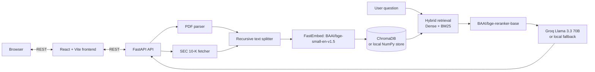

# AlphaRead - Financial Document RAG

AlphaRead is a full-stack Retrieval-Augmented Generation (RAG) application for exploring financial PDFs and selected sections of SEC 10-K filings. Upload a report or fetch filing sections by ticker, then ask grounded questions against the documents held in the local vector store.

## What it does

- Uploads text-based PDF documents and preserves page metadata for citations.
- Fetches and ingests selected 10-K sections: Item 1 (Business), Item 1A (Risk Factors), Item 7 (MD&A), and Item 8 (Financial Statements).
- Downloads a local SEC 10-K dataset for one or more tickers, optionally ingesting it into the RAG store.
- Uses hybrid retrieval: dense semantic search plus BM25 keyword search, fused with reciprocal-rank fusion and reranked with `BAAI/bge-reranker-base`.
- Returns an answer with relevance-scored source citations. If Groq is not configured or unavailable, it produces a source-grounded fallback response.
- Lists, deletes, and clears ingested documents from the persistent store.

## Architecture



## Repository layout

```text
Financial AI Project/
|-- PROJECT.md
|-- backend/
|   |-- main.py              # FastAPI routes and request models
|   |-- rag_service.py       # Ingestion, vector stores, retrieval, chat
|   |-- relevance.py         # Retrieval-score calibration helpers
|   |-- pdf_parser.py        # PDF text extraction
|   |-- sec_parser.py        # SEC filing retrieval and section extraction
|   |-- download_10k.py      # Dataset download utility
|   |-- requirements.txt
|   |-- .env.example
|   |-- tests/
|   `-- eval/
`-- frontend/
    |-- src/
    |   |-- App.jsx
    |   |-- api.js
    |   `-- components/
    |-- package.json
    `-- vercel.json
```

Runtime data such as `chroma_db/`, `vector_store/`, downloaded datasets, virtual environments, and environment files are intentionally ignored by Git.

## Local setup

### Backend

Use Python 3.10 or later.

```powershell
cd backend
python -m venv venv
.\venv\Scripts\Activate.ps1
pip install -r requirements.txt
Copy-Item .env.example .env
uvicorn main:app --reload --host 0.0.0.0 --port 8000
```

Set `GROQ_API_KEY` in `backend/.env` to enable generated answers from Groq. The API remains usable without it and returns a source-grounded fallback answer.

### Frontend

In a separate terminal:

```powershell
cd frontend
npm install
npm run dev
```

The frontend defaults to the deployed API at `https://alpharead-backend.onrender.com`. For local development, create `frontend/.env.local` with:

```dotenv
VITE_API_BASE_URL=http://localhost:8000
```

Then restart the Vite server.

## API reference

| Method | Route | Request | Description |
| --- | --- | --- | --- |
| `GET` | `/health` | - | Returns API status and whether Groq is configured. |
| `POST` | `/upload` | Multipart field: `file` (PDF) | Extracts PDF text by page and ingests it. |
| `POST` | `/ingest-sec` | `{ "ticker": "AAPL", "sections": ["Item 1A", "Item 7"] }` | Fetches and ingests selected 10-K sections. |
| `POST` | `/download-dataset` | `{ "tickers": ["AAPL"], "auto_ingest": true }` | Downloads 10-K data and can ingest it. |
| `POST` | `/chat` | `{ "message": "What risks are discussed?" }` | Returns an answer and supporting citations. |
| `GET` | `/documents` | - | Lists ingested sources and chunk counts. |
| `DELETE` | `/documents/{source_name}` | - | Deletes every chunk for one stored source. |
| `DELETE` | `/clear` | - | Clears the entire vector store. |

Interactive OpenAPI documentation is available at `/docs` while the backend is running.

## Retrieval pipeline

1. Ingestion splits text with `RecursiveCharacterTextSplitter` (`chunk_size=1000`, `chunk_overlap=200`).
2. `BAAI/bge-small-en-v1.5` creates dense embeddings; ChromaDB is used when available, with a persistent NumPy store as a fallback.
3. For each question, the application retrieves dense and BM25 candidates, fuses them with reciprocal-rank fusion, and reranks the results with `BAAI/bge-reranker-base`.
4. A relevance threshold filters weak matches before the selected context is sent to Groq or the local fallback synthesizer.

## Notes

- PDF ingestion supports text-based PDFs. Scanned documents need OCR before upload.
- SEC retrieval is cached in memory during the server process. When SEC responses cannot be fetched within the parser's short timeout, the service falls back to a compact section payload rather than blocking the application.
- The current CORS configuration allows all origins. Restrict it before deploying to a production environment with untrusted clients.
