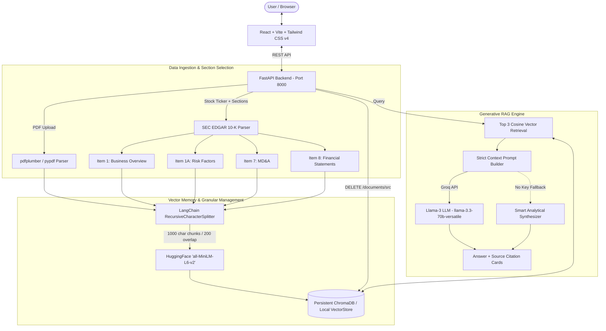

# 📈 AlphaRead - Full-Stack Financial GenAI RAG Application

**AlphaRead** is a production-ready, full-stack Financial GenAI Retrieval-Augmented Generation (RAG) platform built for querying, analyzing, and citing complex financial documents, quarterly reports, and SEC 10-K filings.

---

## 🏗️ System Architecture



---

## ✨ Key Features & Capabilities

1. **Multi-Source Financial Document Ingestion:**
   - **PDF Document Uploader:** Interactive drag-and-drop zone for annual reports, 10-Q statements, earnings transcripts, and financial PDFs.
   - **SEC EDGAR 10-K Fetcher with Section Checkboxes:** Instant retrieval of US public company 10-K reports by stock ticker, allowing users to dynamically select which sections to extract:
     - `Item 1: Business Overview`
     - `Item 1A: Risk Factors`
     - `Item 7: Management's Discussion & Analysis (MD&A)`
     - `Item 8: Financial Statements & Supplementary Data`

2. **Granular Single-Document Deletion:**
   - Trash button (🗑️) on each document in the Knowledge Base list calling `DELETE /documents/{source_name:path}`, allowing users to delete specific files without clearing their entire database.

3. **High-Precision RAG Retrieval Engine:**
   - Text Chunking: `LangChain` `RecursiveCharacterTextSplitter(chunk_size=1000, chunk_overlap=200)`.
   - Embeddings: HuggingFace `'all-MiniLM-L6-v2'` sentence transformers (384-dimensional dense vectors).
   - Vector Memory: Dual-engine architecture with persistent **ChromaDB** and an automatic pure-Python NumPy fallback for Windows environments.

4. **Generative LLM & Interactive Citations:**
   - Integrates with **Groq API** (`llama-3.3-70b-versatile`) for sub-second, multi-paragraph financial reasoning.
   - Every AI response features a dedicated **Source Citation** accordion displaying:
     - 📄 Source Document / SEC Ticker section
     - 📍 Page / Section Metadata
     - 🎯 Relevance Match Score (%)
     - 💬 Verbatim Context Snippet

5. **Humanized Light UI/UX Theme:**
   - Styled with crisp white (`bg-white`) and ultra-soft off-white (`bg-slate-50`).
   - Dark charcoal typography (`text-slate-800`) with generous line-height (`leading-relaxed`).
   - Soft, calming teal and indigo accent buttons (`rounded-2xl`, `rounded-full`).

---

## 📁 Repository Structure

```
Financial AI Project/
├── PROJECT.md                    # Detailed Project Documentation
├── backend/                      # FastAPI Python RAG Server
│   ├── main.py                   # FastAPI app routes, CORS & endpoints
│   ├── rag_service.py            # RAG Engine, ChromaDB & LocalVectorStore
│   ├── pdf_parser.py             # PDF text extraction (pypdf & pdfplumber)
│   ├── sec_parser.py             # SEC EDGAR 10-K parser (Item 1, 1A, 7, 8)
│   ├── download_10k.py           # Automated SEC 10-K dataset downloader script
│   ├── requirements.txt          # Python dependencies
│   ├── .env                      # Environment configuration (GROQ_API_KEY)
│   └── vector_store/             # Persistent vector store index
└── frontend/                     # React + Vite + Tailwind CSS v4 App
    ├── package.json              # Frontend dependencies
    ├── vite.config.js            # Vite build configuration
    ├── postcss.config.js         # PostCSS configuration for Tailwind v4
    ├── index.html                # HTML5 entry template with SEO metadata
    └── src/
        ├── main.jsx              # React DOM render entry point
        ├── index.css             # Tailwind v4 directives & font imports
        ├── App.jsx               # Main dashboard container & state orchestrator
        ├── api.js                # HTTP client for FastAPI backend
        └── components/
            ├── Header.jsx        # Branding, status badges & reset vector store
            ├── IngestionPanel.jsx# Left Column: PDF uploader, SEC section checkboxes & inventory
            ├── ChatPanel.jsx     # Right Column: Chat thread, starter prompts & input
            └── MessageBubble.jsx # User/AI bubbles & collapsible Source Citations
```

---

## 📡 API Endpoint Reference

| Method | Endpoint | Description |
| :--- | :--- | :--- |
| `GET` | `/health` | Server status and Groq LLM configuration check |
| `POST` | `/upload` | Upload PDF file, extract text, chunk and ingest into vector store |
| `POST` | `/ingest-sec` | Fetch SEC 10-K report for ticker symbol with custom `sections: [...]` |
| `DELETE`| `/documents/{source_name:path}` | Delete vector embeddings for a specific source document |
| `POST` | `/chat` | Vectorize user question, retrieve top 3 chunks, return answer & citations |
| `GET` | `/documents` | List all ingested documents and chunk count statistics |
| `DELETE`| `/clear` | Clear all vectors from the database index |
